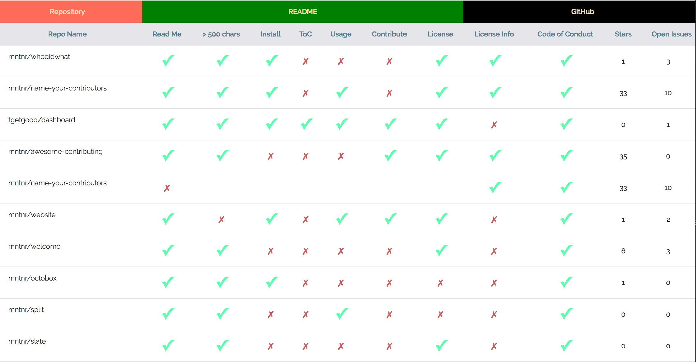

# Maintainer Dashboard

> Maintainer GitHub Dashboard

This is a status board for repositories within a GitHub organization.
It displays build health, and other measures that your community should care about!

Hosted on IPFS!

## Table of Contents

- [Install](#install)
- [Usage](#usage)
  - [Local development](#local-development)
- [Deploy](#deploy)
- [Contribute](#contribute)
- [License](#license)

## Background

This work started with [ipfs/project-repos](https://github.com/ipfs/project-repos). However, as I needed to do some work on it and wanted it to be extendable beyond IPFS, and as I did not have access to the issues for that repository, I have forked it, deleted the history, and made my own copy, here.

## Install

Simply clone this repo.

## Usage

### Local development

To recompile continuously, and start a development server with hot reloading:

    npm run dev

To build minified javascript for production:

    npm run build

### Token

You will need a GitHub token in order to have more requests available to you, as this is a very request-heavy tool. Set it in your environment as `MAINTAINER_DASHBOARD`, or include this token in the `data.json` config in a `token` field.

### Enterprise

Add a `rootURL` field to `data.json` with the endpoint needed.

## Deploy

To deploy this, after merging any new PRs, follow these steps:

1. Have an ipfs daemon running: `ipfs daemon`
2. Kill your `npm run dev` script if you happen to have it running.
3. `npm install && npm prune`
4. `npm run publish`. This should open the published page on the gateway.
5. Pin the hash: `ipfs pin add <hash>`
6. Pin the hash to the gateways, on IRC: `!pin <hash> project-repos.ipfs.io`
7. Post the hash and url to https://github.com/ipfs/ops-requests/issues.

## Contribute

If you would like to contribute code to this repository, please dive in! Check out [the issues](//github.com/mntnr/dashboard/issues).

## License

[MIT](LICENSE)
